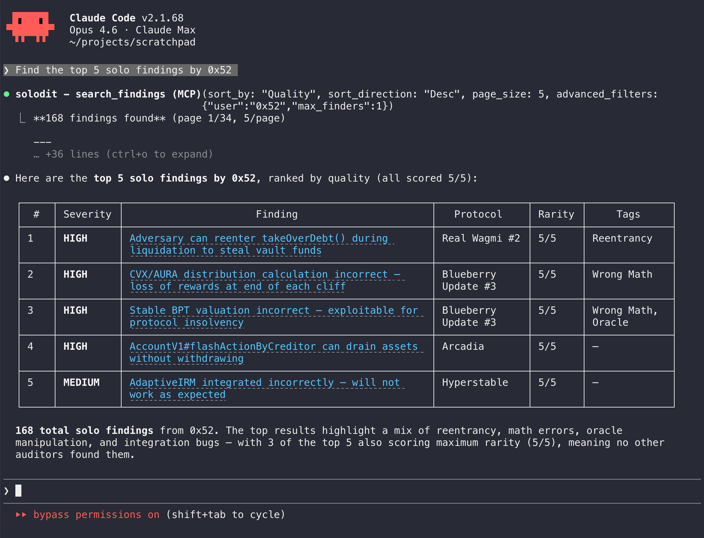

<div align="center">

# claudit

**Smart contract security findings for AI coding agents**

Search [Solodit](https://solodit.cyfrin.io)'s 20,000+ audit findings from Claude Code and Codex CLI.

[](https://www.npmjs.com/package/@marchev/claudit)
[](LICENSE)
[](package.json)

<br />

[Quick Start](#quick-start) · [Tools](#tools) · [Examples](#examples) · [Configuration](#configuration)

</div>

---



---

## Quick Start

```bash
curl -fsSL https://raw.githubusercontent.com/marchev/claudit/main/install.sh | sh
```

The installer detects Claude Code and/or Codex CLI, prompts for your [Solodit API key](https://solodit.cyfrin.io), and registers the MCP server.

Then just ask:

```
> Find 5 solo findings by 0x52 at Sherlock
```

<details>
<summary><strong>Manual install</strong></summary>

### Claude Code

```bash
claude mcp add --scope user --transport stdio solodit \
  --env SOLODIT_API_KEY=sk_your_key_here \
  -- npx -y @marchev/claudit

# (Optional) Install companion skill
mkdir -p ~/.claude/skills/solodit
curl -fsSL https://raw.githubusercontent.com/marchev/claudit/main/.claude/skills/solodit/SKILL.md \
  -o ~/.claude/skills/solodit/SKILL.md
```

### Codex CLI

```bash
codex mcp add solodit \
  --env SOLODIT_API_KEY=sk_your_key_here \
  -- npx -y @marchev/claudit
```

</details>

---

## Tools

### `search_findings`

Search across all findings with filters.

| Parameter | Type | Description |
|:----------|:-----|:------------|
| `keywords` | `string` | Text search in title and content |
| `severity` | `string[]` | `HIGH` `MEDIUM` `LOW` `GAS` (case-insensitive) |
| `firms` | `string[]` | Audit firm names |
| `tags` | `string[]` | Vulnerability tags |
| `language` | `string` | Programming language |
| `protocol` | `string` | Protocol name (partial match) |
| `reported` | `string` | `30` `60` `90` `alltime` |
| `sort_by` | `string` | `Recency` `Quality` `Rarity` |
| `sort_direction` | `string` | `Desc` (default) `Asc` |
| `page` | `int` | Page number (default 1) |
| `page_size` | `int` | Results per page (default 10, max 100) |
| `advanced_filters` | `object` | See below |

<details>
<summary><strong>Advanced filters</strong></summary>

| Field | Type | Description |
|:------|:-----|:------------|
| `quality_score` | `number` | Minimum quality score (0-5) |
| `rarity_score` | `number` | Minimum rarity score (0-5) |
| `user` | `string` | Finder/auditor handle |
| `min_finders` | `number` | Minimum number of finders |
| `max_finders` | `number` | Maximum number of finders |
| `reported_after` | `string` | ISO date string |
| `protocol_category` | `string[]` | Protocol categories |
| `forked` | `string[]` | Forked protocol names |

</details>

### `get_finding`

Get full details for a specific finding by numeric ID, Solodit URL, or slug.

### `get_filter_options`

List all valid filter values — firms, tags, categories, languages — with finding counts.

---

## Examples

```
Search Solodit for oracle manipulation HIGH severity findings
Find all Sherlock findings about flash loans
What reentrancy issues exist in lending protocols?
Show me solo findings by 0x52
Get recent HIGH severity Solidity findings sorted by quality
```

---

## Configuration

<details>
<summary><strong>Update API key</strong></summary>

**Claude Code:**
```bash
claude mcp remove solodit
claude mcp add --scope user --transport stdio solodit \
  --env SOLODIT_API_KEY=sk_new_key \
  -- npx -y @marchev/claudit
```

**Codex CLI:**
```bash
codex mcp remove solodit
codex mcp add solodit \
  --env SOLODIT_API_KEY=sk_new_key \
  -- npx -y @marchev/claudit
```

**Cursor MCP**
```json
{
  "mcpServers": {
    "solodit": {
      "command": "npx",
      "args": ["-y", "@marchev/claudit"],
      "env": {
        "SOLODIT_API_KEY": "sk_new_key"
      }
    }
  }
}
```

</details>

<details>
<summary><strong>Uninstall</strong></summary>

**Claude Code:**
```bash
claude mcp remove solodit
rm -rf ~/.claude/skills/solodit
```

**Codex CLI:**
```bash
codex mcp remove solodit
```

</details>

<details>
<summary><strong>Development</strong></summary>

```bash
git clone https://github.com/marchev/claudit.git
cd claudit
npm install
npm run build

# Test locally
SOLODIT_API_KEY=sk_your_key node dist/index.js
```

</details>

---

<div align="center">

MIT License

</div>
